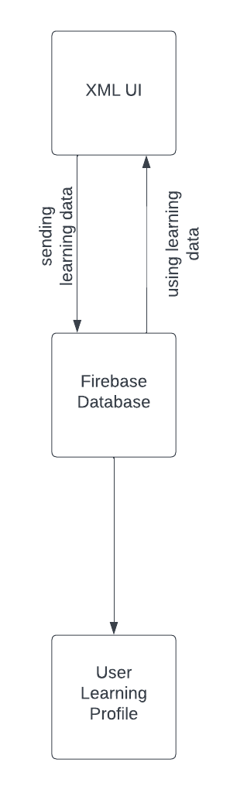
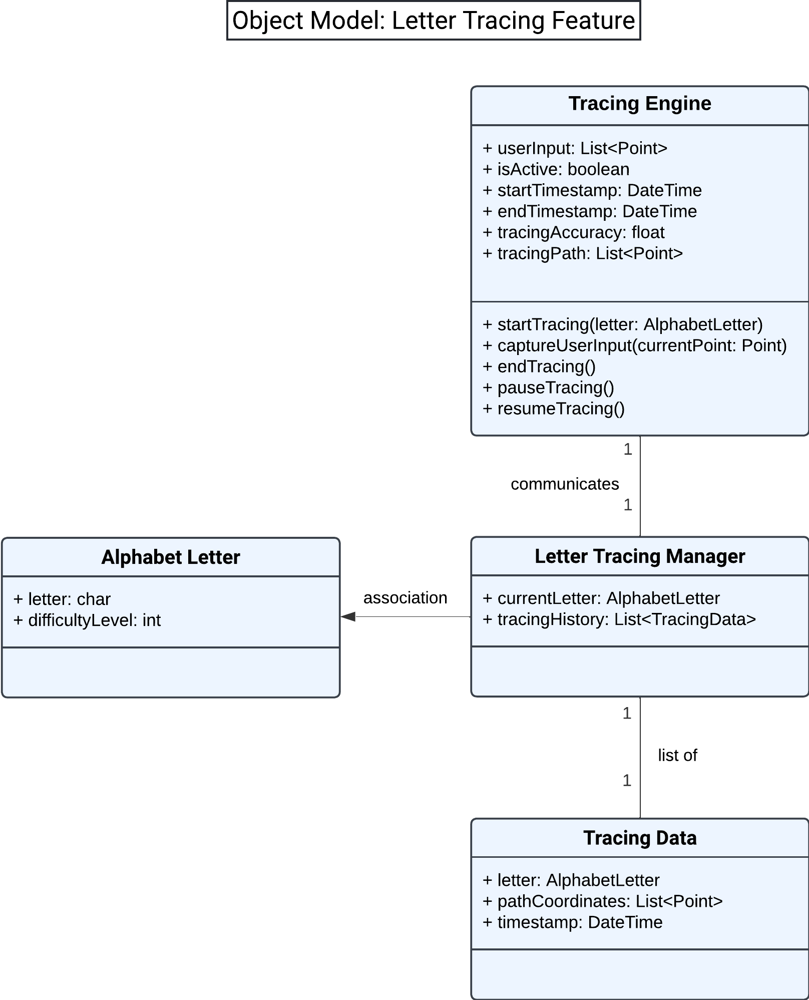
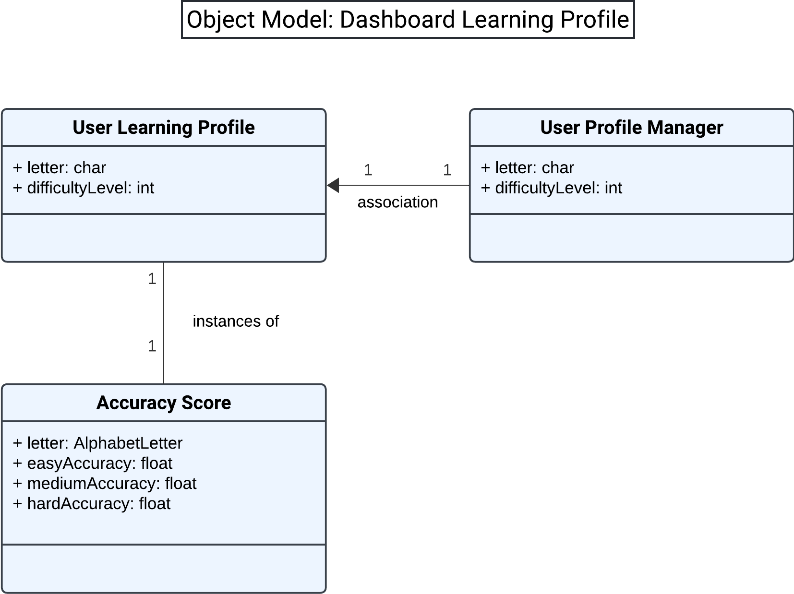
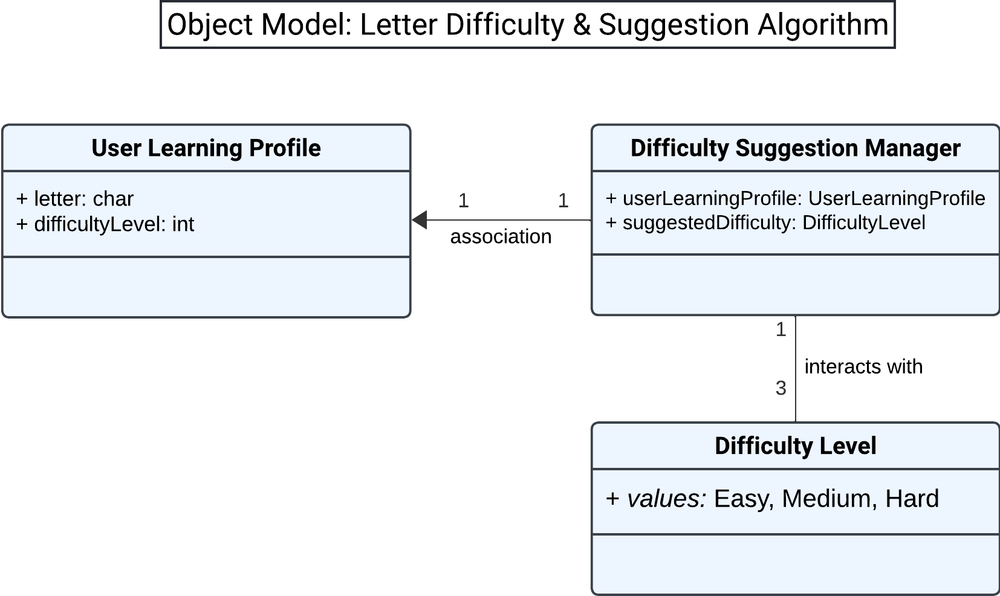
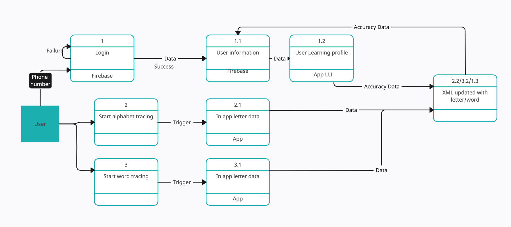
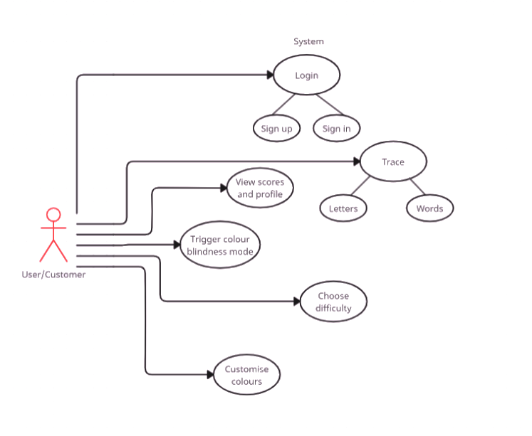
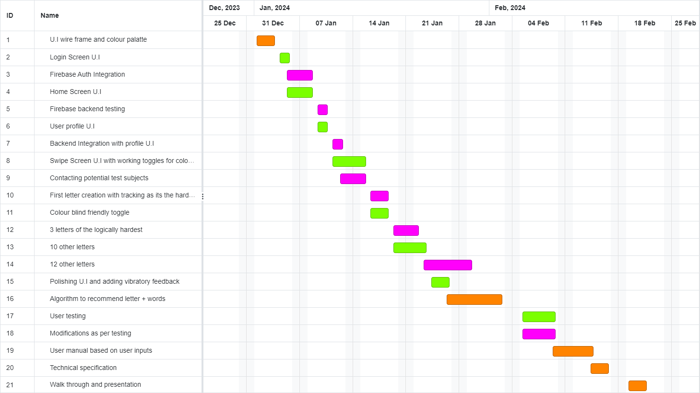

# Table Of Contents
1. [Introduction](#1-introduction)

    1.1 [Overview](#11-overview)

    1.2 [Business Context](#12-business-context)

    1.3 [Glossary](#13-glossary)
    
2. [General Description](#2-general-description)

    2.1 [Product / System Functions](#21-product-system-functions)

    2.2 [User Characteristics and Objectives](#22-user-characteristics-and-objectives)

    2.3 [Operational Scenarios](#23-operational-scenarios)

    2.4 [Constraints](#24-constraints)

3. [Functional Requirements](#3-functional-requirements)

4. [System Architecture](#4-system-architecture)

    4.1 [Product / System Functions](#41-product-system-functions)

    4.2 [Architectural Components Reuse and Third-Party Integration](#42-architectural-components-reuse-and-third-party-integration)

    4.3 [Interaction Between Components](#43-interaction-between-components)

    4.4 [Scalability and Future Considerations](#44-scalability-and-future-considerations)

5. [High-Level Design](#5-high-level-design)

6. [Preliminary Schedule](#6-preliminary-schedule)

    6.1 [Major Tasks and Interdependencies](#61-major-tasks-and-interdepedencies)

    6.2 [Project Plan](#62-project-plan)
    
    6.3 [Resource Requirements](#63-resource-requirements)

  
# 1. Introduction
## 1.1 Overview
The proposed system is an educational application that is designed for children. It aims to provide children the ability to learn the english alphabets through interactive and engaging activities.  The system will be in the form of a mobile application which will provide a platform for children to learn how to draw each alphabet using the touch screen of the device. The key feature of this application is traceable lines/dots which allow the user to practice drawing each letter as well as learning the alphabets.

The application encourages an interactive and hands-on approach to learning where the users can use their fingers or a stylus to trace the alphabets on the screen. The screen will have customization options allowing the user to choose their preferred colour for tracing. Importantly, the app is designed to provide a positive and non-pressurized environment for learning. 
  
## 1.2 Business Context
This educational app is committed to promoting early childhood education. The organization recognizes the importance of combining technology with learning to enhance children's cognitive development. The app is intended for deployment on various platforms such as Android and IOS primarily for mobile devices. The organization views the app as a valuable tool for parents and educators to support children in developing fundamental writing skills.
  
## 1.3 Glossary
* **Trace 'N Learn Books -** Physical books used as a reference for tracing alphabets.
* **Stylus -** A digital pen or input device used on touchscreen devices.
* **Learning Scores -** Performance metrics indicating the accuracy of alphabet tracing.
* **Database -** A structured storage system for storing learning scores.
* **Algorithm -** A set of rules determining the suggestion of the next letter based on accuracy.
* **Sensory Feedback -** Visual, auditory, and tactile responses provided by the application.
* **UI/UX -** User Interface/User Experience refers to the design and interaction aspects of the application.
  
# 2. General Description
## 2.1 Product / System Functions
The system functions as an interactive educational tool allowing children to learn to write English alphabets through tracing exercises. It includes features such as customizable colours, accuracy scoring, difficulty levels, and modes for tracing letters and words.
  
## 2.2 User Characteristics and Objectives
The target users are children aged 5 to 11 years. The app is designed with a user-friendly interface to accommodate varying levels of technological experience. The objectives include providing an engaging learning experience, tracking user progress, and offering customization options to adapt to individual learning needs.
  
## 2.3 Operational Scenarios
Operational scenarios include various situations where the user interacts with the app. Scenarios may include a child tracing a letter or a parent reviewing learning scores.
  
## 2.4 Constraints
Constraints include the need for a simplistic UI design to avoid overwhelming children. Speed requirements, compatibility with industry protocols, and platform constraints for Android, Mac, and Windows are considered.
  
# 3. Functional Requirements
## 3.1 Functional Requirement 1: Alphabet Tracing Interface

- **Description:** The system should provide an interactive interface where users can trace English alphabets using touchscreen motion.
- **Criticality:** High
- **Technical Issues:** Ensure the image views are laid out in the shape of the alphabet and that there is some connection between them, which is how we track the accuracy.
- **Dependencies with other requirements:** Dependent on the accuracy of the connection/swipes between image views. Sensory feedback will be provided when swiped across the accurate image views.
  
## 3.2 Functional Requirement 2: Customizable Colors

- **Description:** Users should have the ability to choose the color of the traced lines.
- **Criticality:** Medium
- **Technical Issues:** Implement a color picker interface that is compatible across different devices.
- **Dependencies with other requirements:** Linked to the alphabet tracing interface and sensitivity to color-blind users.
  
## 3.3 Functional Requirement 3: Learning Score Calculation

- **Description:** The system should calculate and display a learning score based on the accuracy of alphabet tracing of the image views.
- **Criticality:** High
- **Technical Issues:** Develop an algorithm to evaluate accuracy - which is tracking how many image views have been passed through in the swipe/connect and store scores.
- **Dependencies with other requirements:** Connected to the alphabet tracing interface, database integration, and the learning profile dashboard.
  
## 3.4 Functional Requirement 4: Difficulty Level Assignment

- **Description:** Each alphabet should be assigned a difficulty score based on the user's accuracy in determining the suggested difficulty for the next challenge.
- **Criticality:** High
- **Technical Issues:** Design an algorithm to understand accuracy scores, which will be done by tracking how many image views have been accurately swiped/connected through and recommend other letters/words (depending on word/letter mode) of appropriate difficulty levels.
- **Dependencies with other requirements:** Tied to learning score calculation and the alphabet tracing interface.
  
## 3.5 Functional Requirement 5: Word Tracing Modes

- **Description:** The system should offer two modes - one for tracing individual letters and another for tracing complete words.
- **Criticality:** Medium
- **Technical Issues:** Develop an option between letter and word tracing modes.
- **Dependencies with other requirements:** Connected to the alphabet tracing interface and learning score calculation.
  
## 3.6 Functional Requirement 6: Difficulty-Based Word Categorization

- **Description:** Words in the word tracing mode should be categorized into easy, medium, and hard based on the difficulty levels of the letters they contain.
- **Criticality:** Medium
- **Technical Issues:** Use difficulty scores assigned to individual letters to categorize words.
- **Dependencies with other requirements:** Linked to the difficulty level assignment and word tracing modes.
  
## 3.7 Functional Requirement 7: Sensory Feedback Modes

- **Description:** Users should have the option to enable or disable sensory feedback modes, including vibrations, colored lines, and sound.
- **Criticality:** Medium
- **Technical Issues:** Implement a user-friendly interface for toggling sensory feedback as it may be a bit too overstimulating for some, whereas having no feedback would have been understimulating for others.
- **Dependencies with other requirements:** Connected to the alphabet tracing interface and sensory feedback feature.
  
## 3.8 Functional Requirement 8: Color Blind-Friendly Mode

- **Description:** The system should include a color blind-friendly mode for users with visual impairments allowing them to toggle on/off color-related features.
- **Criticality:** Medium
- **Technical Issues:** Implement color schemes that consider color blindness and provide alternative options.
- **Dependencies with other requirements:** Linked to the customizable colors feature.
  
# 4. System Architecture
The system architecture is a foundational element that outlines the high-level structure and organization of the educational app for tracing English alphabets. A well-designed architecture is essential for scalability, maintainability, and the seamless integration of various components. The system design should effectively manage user interactions, data storage, and external dependencies inside the framework of the alphabet tracing application. Below is an overview of the system architecture:

{:style="display:block; margin-left:auto; margin-right:auto"}

## 4.1 Product / System Functions
The system architecture is scalable and modular in order to support both present and future functionality. Key architectural components include:

**User Interface (UI) -** The UI component deals with the presentation layer providing an interactive and intuitive interface for users to trace alphabets. It includes design principles that prioritize simplicity and user engagement while being not over stimulating and maintaining a neutrality.

**Tracing Engine -** This component is responsible for accurately detecting and understanding user input during alphabet tracing. It interacts with the UI to capture touch gestures or stylus movements ensuring a responsive and precise tracing experience.

**Learning Score Calculation Module -** The learning score calculation module analyzes the traced alphabet patterns and outputs a learning score. It uses an algorithm to evaluate the accuracy of tracing movements which contributes to the user's overall progress.

**Difficulty Level Assignment Algorithm -** This algorithm assesses the user's performance on each alphabet and assigns a difficulty score. The score determines the system's recommendations for the next alphabet to trace creating a personalized learning path.

**Database Integration -** The system depends on a database to store user profiles, learning scores, and other relevant data. Firebase is the chosen database platform offering secure data storage.

**Sensory Feedback Module -** This module manages the sensory feedback features including vibrations, coloured lines, and sound. It enhances the user experience by providing engaging feedback during tracing activities.
  
## 4.2 Architectural Components Reuse and Third-Party Integration
**Firebase Backend -** The system uses Firebase for database integration utilizing Firebase Realtime Database to store and fetch learning scores securely. Firebase Authentication ensures user data is safely stored.

**Android Studio -**  The app is developed using Android Studio which is the official integrated development environment (IDE) for Android app development. It provides tools for designing UI, writing code, and testing the app.
  
## 4.3 Interaction Between Components
* The UI interacts with the Tracing Engine to capture and visualize user input during alphabet tracing.
* The Tracing Engine communicates with the Learning Score Calculation Module to evaluate the accuracy of tracing movements and calculate learning scores.
* The Difficulty Level Assignment Algorithm receives data from the Learning Score Calculation Module to determine the appropriate difficulty level for the next alphabet.
* The Database Integration component manages the storage and fetching of user profiles and learning scores.
* The Sensory Feedback Module interfaces with the Tracing Engine to provide sensory feedback during tracing activities.

## 4.4 Scalability and Future Considerations
The system architecture is designed with scalability in mind allowing for the addition of new features in future releases. The system architecture provides a robust and flexible base for the development of the alphabet tracing app. It ensures efficient data management, accurate tracing interactions, and a positive user experience. Future features may include advanced analytics for detailed user progress and expanding language support.
  
# 5. High-Level Design

**Figure 1. - Object Model of Sensory Feedback**

The 'Sensory Feedback Module' receives signals from the 'Tracing Engine' which show events like the completion of an alphabet being traced. The recieved signals from the 'Sensory Feedback Manager' activates or deactivates the relevant controllers. The 'Vibraton Controller', 'Coloured Lines Controller', and 'Sound Controller' adjust their settings and give feedback accotding to those settings.

  

**Figure 2. - Object Model of Letter Tracing Feature**

The 'Letter Tracing Manager' recieves a request to start tracing a new letter. It fetches the 'Alphabet Letter' object and sets it as the current letter. The 'Tracing Engine' captures the users input and the 'Letter Tracing Manager' updates the tracing history in real time. When the user completes the tracing the 'Tracing Engine' sends a sign to the 'Letter Tracing Manager' to complete the tracing session. The 'Letter Tracing Manger' stores the tracing data, calculates the accuracy scores and updates the users learning profile.

  

**Figure 3.- Dashboard Learning Profile**

The 'User Profile Manager' fetches the users learning profile when starting up the application. The 'User Learning Profile' is updated during and after each tracing session with the new accuracy scores. The 'Accuracy Score' is updated based on the difficulty level of the traced letter. The overall progress is calculated in the 'User Profile Manager' and shown in the user's dashboard.

  

**Figure 4. - Letter Difficulty & Suggestion Algorithm**

The 'Difficulty Suggestion Manager' studies the user's learning profile to determine the user's current level. Based on the user's performace the manager suggest a difficulty level for the next letter tracing session. The difficulty is then used by other modules such as the 'Letter Tracing Feature' and the 'Dashboard Learning Profile'.

  

**Figure 5. - Data Flow Diagram**

In the data flow diagram, there are three cases: when the user logs in, when they attempt to trace a letter, and when they trace a word. If the login fails, they are redirected to the login screen. If it is successful, user data is fetched from Firebase to populate profile which the parents can access which is then utilized to support the algorithms for suggesting letters and words. Additionally, user accuracy data is sent to the database.

  

**Figure 6. - Use Case Diagram**

# 6. Preliminary Schedule
## 6.1 Major Tasks and Interdepedencies
**1. Designing of the UI/UX of the application**
   - Dependencies: None
   - Time Estimated: 1 week
   - Interdependencies: None

**2. Application Authentication**
   - Dependencies: UI/UX Design
   - Time Estimated: 1 week
   - Interdependencies: None

**3. Firebase Backend Integration**
   - Dependencies: UI/UX Design, Application Authentication
   - Time Estimated: 2 weeks
   - Interdependencies: None

**4. Dashboard Learning Profile**
   - Dependencies: Firebase Backend Integration
   - Time Estimated: 2 weeks
   - Interdependencies: None

**5. Tracking Movement Of User's Swipe**
   - Dependencies: UX/UI Design
   - Time Estimated: 2 weeks
   - Interdependencies: None

**6. Letter Tracing Feature**
   - Dependencies: UX/UI Design
   - Time Estimated: 2 weeks
   - Interdependencies: None

**7. Sensory Feedback**
   - Dependencies: Letter Tracing Feature
   - Time Estimated: 2 weeks
   - Interdependencies: None

**8. Letter Difficulty & Suggestion Algorithm**
   - Dependencies: Letter Tracing Feature
   - Time Estimated: 2 weeks
   - Interdependencies: None

**9. Swipe Accuracy Rate Percentage**
   - Dependencies: Letter Tracing Feature
   - Time Estimated: 2 weeks
   - Interdependencies: None

**10. Colour Blindness Feature**
   - Dependencies: UI/UX Design
   - Time Estimated: 1 week
   - Interdependencies: None

## 6.2 Project Plan

**Figure 6. - Gantt Chart Diagram**

The orange section is allocated for combined work. The green section is allocated work for Dzastina. The pink section is allocated work for Malavika.

## 6.3 Resource Requirements
**Hardware**
- Developer computers that are compatible with Android Studio
- Testing using Android, Mac, and Windows

**Software**
- Android Studio
- Firebase Database
- Firebase Authentication
- Development tools for UI/UX design

**Wetware**
- Development team with experience in Kotlin or Java, XML, Android app development, and Firebase integration
