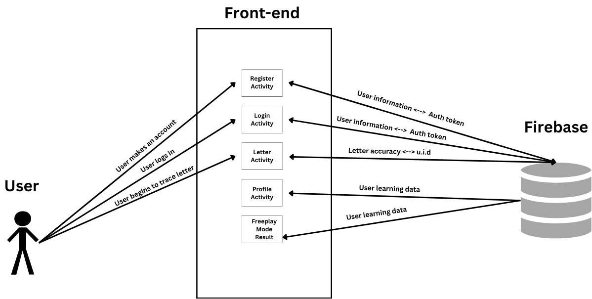
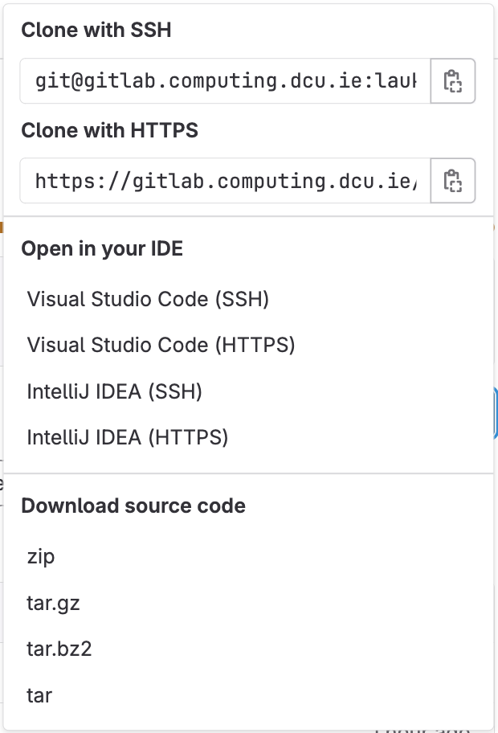
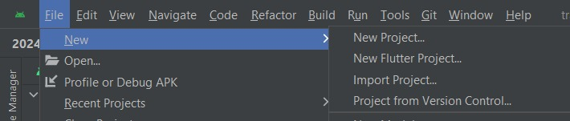
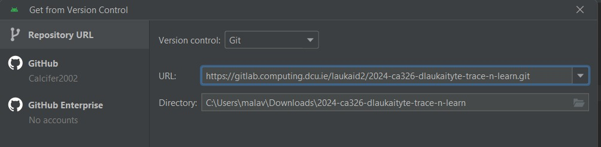
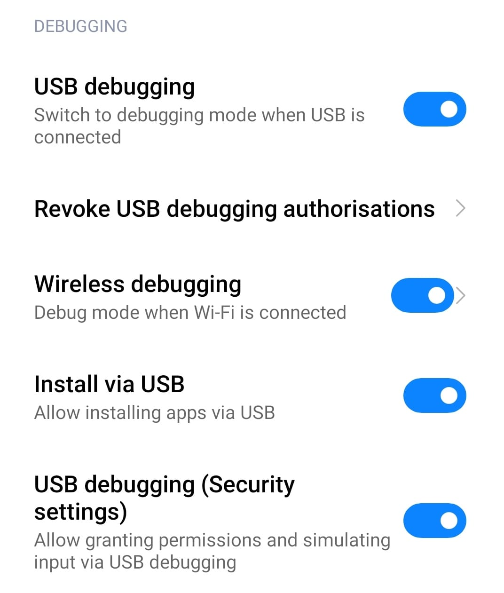
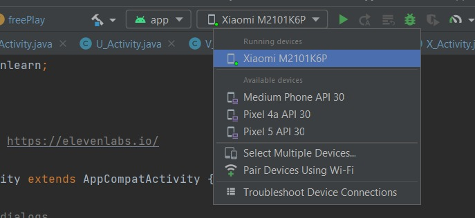

# Table Of Contents
1. [Introduction](#1-introduction)

    1.1 [Overview](#11-overview) 

    1.2 [Glossary](#12-glossary)

    1.3 [Research](#13-research)

    1.4 [Features](#14-features)

2. [System Architecture](#2-system-architecture) 

    2.1 [Product / System Functions](#41-product-system-functions) 

    2.2 [Architectural Components Reuse and Third-Party Integration](#42-architectural-components-reuse-and-third-party-integration) 

    2.3 [Interaction Between Components](#43-interaction-between-components)

    2.4 [Scalability and Future Considerations](#44-scalability-and-future-considerations) 

3. [High-Level Design](#3-high-level-design)

4. [Problems and Solutions](#4-problems-and-solutions) 

    4.1 [Detecting Letter Strokes](#41-detecting-letter-strokes) 

    4.2 [Detecting Finishing Stroke](#42-detecting-finishing-stroke)

    4.3 [False Positive Strokes](#43-false-positive-strokes)

    4.4 [User Interface](#44-user-interface)
 
5. [Testing](#5-testing)

    5.1 [Unit Testing](#51-unit-testing) 

    5.2 [User Testing](#52-user-testing)

    5.3 [Integration Testing](#53-integration-testing)

6. [Installation Guide](#6-installation-guide)

    6.1 [Software Dependencies](#61-software-dependencies) 

    6.2 [Hardware Requirements](#62-hardware-requirements) 

    6.3 [Step By Step](#63-step-by-step)

7. [References](#7-references)

    7.1 [Code](#71-code)

    7.2 [User Interface](#72-user-interface)
  
# 1. Introduction
## 1.1 Overview
The system is an educational application tailored for children, specifically focusing on facilitating the learning of the English alphabet through interactive and engaging activities. This mobile application provides a platform in which children can hone their skills in drawing each letter of the alphabet using the touch screen functionality of their devices.
 
At its core, the application features traceable lines guiding the users through the process of drawing each letter. This interactive approach assists in letter recognition and also promotes motor skill development. Moreover, the app fosters a positive and stress-free learning environment encouraging children to engage with the material at their own pace while simultaneously having fun.

Standout features of the application include its child-friendly user interface design, non-competitive style to take the pressure off children, audio voices for letters so that they can learn the pronunciation, colour palette for children to change the colours of their strokes, Freeplay mode where they are given 13 letters whose difficulty is based on previous letters difficulty and Custom Play mode where the child can pick the letter they want to trace. The child-friendly user interface consists of vibrant colours, charming illustrations of animals, and nature images creating an inviting and immersive environment for children. Customization options allow children to personalize their learning experience. Children can choose their preferred colours for tracing, adding a layer of creativity to the educational process. Parents can use the accuracy tracking profile page to track the progress of their child’s learning and encourage them to try harder or easier letters as they learn. To ensure a non-competitive environment the children are shown flowers to show how many letters they have done in Custom play mode and some accuracy scores in the Freeplay mode which the parents can decipher as a one-time thing.
  
## 1.2 Glossary
* **Trace 'N Learn Books -** Physical books used as a reference for tracing and learning the alphabets.
* **Learning Scores -** Performance metrics indicating the accuracy of alphabet tracing.
* **Database -** A structured storage system for storing learning scores.
* **Algorithm -** A process or set of rules to be followed in calculations or other problem-solving operations, especially by a computer.
* **Sensory Feedback -** Visual, auditory, and tactile responses provided by the application.
* **UI/UX -** User Interface/User Experience refers to the design and interaction aspects of the application.
  
## 1.3 Research
### Letter Tracing
In order to get a very clear tracing, we had to experiment with multiple methods.

**1. Google Digital Ink API.**
Digital Ink API is used to check what letter the user drew using strokes. It makes a builder and then processes all the strokes together. This logic is used in writing keyboards where if you write a letter “A” the letter A is outputted instead of you having to type it.
While using the digital Ink API the issue was that it was not checking if the letter was drawn over the tracing outline or not. It was only checking if the user drew a letter “A”, “B” and so on. If it is outside the tracing outline and it outputs- a letter drawn then the “tracing” of the app is made pointless. The diagram here, the letter is still detected as a V even though it is outside the boundary.

**Figure 1.** - Tracing letter V

**2. Connecting dots/Image views**
Another attempt was made at having the user connect Image views or dots. But the issue was that if the user were to make a diagram like the one below- It would be detected as an I, even though the trace does not make an I.

**Figure 2.** - Connecting dots

**3. Comparing the strokes with the image**
The final method that worked for us was having a bitmap of a letter - say “A”, getting its coordinates, and then comparing that with the coordinates of the stroke. Though there is room for improvement it worked best from what we had tried.

### Difficulty Categorization of Letters for Classic and Free Play Modes
National Library of Medience article - https://www.ncbi.nlm.nih.gov/pmc/articles/PMC4557880/ 

The article had a very detailed section of which letters were difficult for each age group. We took the results of this along with feedback and opinions from parents as well as teachers - which letters were the hardest and came up with the letter difficulty array of 
("L", "T", "I", "V", "H", "F", "E", "N", "C", "U", "M", "W", "X", "J", "O", "P", "D", "A", "B", "S", "Z", "Y", "K", "Q", "R", "G")

where the difficulty increases from left to right.
  
## 1.4 Features
* **Authentication:** Firebase authentication along with the help of firebase data base we were able to implement auth function where the application gets user information and sends it to firebase who sends it back with a token.
* **Colour panel**:The user can switch between different colours while tracing letters
* **Freeplay mode**: In the freeplay mode the user starts off with one letter - letter “L” and depending on their accuracy on that they are given another letter to trace and depending on the accuracy of that letter, another letter and the cycle continues.
At the end of the mode a one time report is generated that tells them how well they did with statistics
* **Classic**: In the classic mode the user can pick their own letter and the accuracy score of that letter is updated in the profile
Change username: The user can change username any time
Profile: The profile contains all the data extracted from the user in a very readable way to understand the childs tracing abilities
Voice feed back: We have consistent voice feed back all throughout the application so that even children who cannot read can use it.
Vibration : We give haptic feed back via vibrations to keep them more interested.
* **Flowers**: For every accurate letter we increment by one so that we represent the progress of the child in a very friendly way.
  
# 2. System Architecture
The system architecture is a foundational element that outlines the high-level structure and organization of the educational app for tracing English alphabets. A well-designed architecture is essential for scalability, maintainability, and the seamless integration of various components. The system design effectively manages user interactions, data storage, and external dependencies inside the framework of the alphabet tracing application. Below is an overview of the system architecture:

**Figure 3.** - System Architecture Diagram

The System architecture consists of Firebase and the App itself. The data storage and auth takes place within firebase and the above diagram is a detailed view of the data flow between them

**App** - The application takes the user data, parses it into a form it can reuse and feed it to firebase database.

**Database** - The database stores the data and makes it usable when ever the app requires it.
  
## 2.1 Product / System Functions
The system architecture is scalable and modular to support both present and future functionality. Key architectural components include:

**Frontend** - The frontend authenticates the user and helps in visualizing the data stored in the database in a very attractive and interesting way that the user can easily understand.

**Backend** - The backend authenticates the user with the help of the front and takes data from firebase to and sends it to the frontend
T
he profile page is an example of this:

**Figure 4.** - Front-end

**Database:** The Firebase database stores the data that the application sends and needs. Below is a screenshot of the users child in the firebase database where the long combination of letters and numbers is the user UID, under which we have stored the relevant keys such as:

* If they attempted letters or not, 
* Their traced accuracy value
* Flower counter to represent progress of the 
* Free play keys of the same

The storage keys for each user keeps going till z and we have a “username” key where we store the users username.

**Figure 5.** - Backend
  
## 2.2 Architectural Components Reuse and Third-Party Integration
**Firebase Backend -** The system uses Firebase for database integration utilizing Firebase Realtime Database to store and fetch learning scores securely. Firebase Authentication ensures that the user’s data is safely and securely stored.

**Android Studio -** The application was developed using Android Studio which is the official integrated development environment (IDE) for Android app development. It provided tools for designing U.I. writing code, and testing the application.
  
## 2.3 Interaction Between Components
* The interaction between components is very simple and straight
* The front end is the way by which the user interacts with the backend
* The backend gets and sends information from and to Firebase
* The front end is populated by backend with the information the backend gets from Firebase.
  
## 2.4 Scalability and Future Considerations
The system architecture is designed with scalability in mind allowing for the addition of new features in future releases. The system architecture is robust and flexible for the development of the alphabet tracing application. It ensures efficient data management, accurate letter tracing, and a positive user experience. Future features may include advanced analytics for detailed user progress and expanding language support. Additionally, having a feature to trace words and whole sentences for advanced users.
  
# 3. High-Level Design
…

**Figure 6.** - Sequenece Diagram**
  
# 4. Problems and Solutions
## 4.1 Detecting Letter Strokes
As we progressed with the functional aspect of our project we encountered a problem. This problem arose when attempting to test the functionality of detecting letter strokes. It was very difficult to calculate if a letter was drawn correctly and accurately according to the	letter guide or if it was drawn a bit outside of the letter guide. To solve this problem we ended up using the combination of stroke coordinate length and accuracy metrics where both had to be above a certain level for the letter drawn to be counted as correct. After this result was obtained we then normalized the the final accuracy score.
  
## 4.2 Detecting Finishing Stroke
Another problem we encountered was how to determine whether a user was finished drawing their strokes. To solve this issue we decided to have a 3 second timeout after the user draws their last stroke. This helped the system to function better as it was able to more accurately determine the user's score considering that the system knew it was the last stroke drawn
  
## 4.3 False Positive Strokes
Another problem we ran into was our application returning false positives if a letter was partly traced. To combat this issue we decided to increase the size of the stroke coordinates required to output that the letter has been traced correctly. Additionally, we added a pop-up to inform the user to trace the letters more slowly.
  
## 4.4 User Interface
The User Interface (U.I.) proved to be quite challenging at times. We strived to use images that we were license-free and ended up using the website Freepik for our source of images. It was difficult to find a theme of images that were of similar design styles. We ended up settling on the theme of nature and animals as we wanted the application to create a positive and stress-free learning environment encouraging children to engage with the material at their own pace while simultaneously having fun.

Creating constraints using Android Studio for the images proved to be frustrating at times. When creating the constraints using Android Studio on either a Macbook or a Windows laptop once tested using an Android device the constraints would not align and in turn, it would misplace the U.I. of the application. We spent a lot of time working on the constraints to ensure that they aligned correctly when using an Android device as it greatly impacted the user’s experience
  
# 5. Testing
## 5.1 Unit Testing
...
  
## 5.2 User Testing
.The Trace 'N Learn application was tested on 5 participants who were parents who met certain criteria. This critera was that the parent had a child/children in the age range of 3 to 11 years old who was learning their alphabets. The reason for this criteria was for the parent to be able to provide us with their insight on the Trace ‘N Learn application and how their child might interact with it. 

The parent tested the application by drawing strokes and tracing various letters at random. Once the testing was completed they were given a Google form to fill out about their experience using the application. The results are as follows:

**Figure 7.** - Google Form Survey Response

The above pie chart shows the response to the question being asked “Do you think a child would be able to easily create/draw the strokes?” and the response was 80% said yes and the other 20% said maybe. This is a very positive response which shows that our application can handle the input of a user’s stroke which is the main functionality of our application.

**Figure 8.** - Google Form Survey Response

The above pie chart shows the response to the question being asked “Do you think a child would be stressed when using the Trace ‘N Learn application?”. This is very important question as our aim for the application was to create a strees free and enjoyable learning environment for children. The responses from the survey shows that we did met our aim of creating an application that is stress free as all participants said their child would not be stressed using the "Trace 'N Learn".  
  
## 5.3 Integration Testing
...
  
# 6. Installation Guide
## 6.1 Software Dependencies
**1. JUnit** (‘junit:junit:4.13.1’) - JUnit is a unit testing framework for the Java programming language.
**2. Mockito** (‘org.mockito:mockito-core:3.12.4’) - Mockito is a mocking framework that allows to mock objects in tests.
**3. PowerMock** (‘org.powermock:powermock-module-junit4:2.0.9’, ‘org.powermock:powermock-api-mockito2:2.0.9’) - PowerMock is a framework used to extend other mocking frameworks like Mockito to provide additional features.
**4. Robolectric** (‘org.robolectric:robolectric:4.7.3’) - Robolectric is a framework that allows for unit testing of Android applications.
**5. AndroidX Test** (‘androidx.test:rules:1.4.0’, ‘androidx.text.ext:junit:1.1.2’) - AndroidX Test provides testing utilities for Android applications.
**6. Espresso** (‘androidx.test.espresso:espresso-core:3.3.0’) - Espresso is a testing framework used for Android UI testing.
**7. Firebase** (‘com.google.firebase:firebase-bom:32.7.0’) - Firebase is a platform provided by Google for building mobile and web applications.
* **7.1 Firebase Authentication** (‘com.google.firebase:firebase-auth’)
* **7.2 Firebase Realtime Database** (‘com.google.firebase:firebase-database:20.3.0’)
* **7.3 Firebase Cloud Storage** (‘com.google.firebase:firebase-storage:20.3.0’)
* **7.4 Firebase Firestone** (‘com.google.firebase:firebase-firestone:24.10.1’)
**8. Google Play services** (‘com.google.android.gms:play-services-auth:20.7.0’) - Google Play services provide APIs for Android applications to access Google services.
**9. AndroidX Libraries**
* **9.1 AppCompat** (‘androidx.appcompat:appcompat:1.6.1’) 
* **9.2 Material Design Components** (‘com.google.android.material:material:1.9.0’)
* **9.3 Constraint Layout** (androidx.constraintlayout:constraintlayout:2.1.4’)
**10. ML Kit Digital Ink Recognition** (‘com.google.mlkot:digital-ink-recognition:18.1.0’) - ML kit is a mobile SDK provided by Google for integrating machine learning models into mobile applications.
  
## 6.2 Hardware Requirements
**1. Software Compatibility** -  A developer computer which is compatible with Android Studio.

**2. Operating System** - Run tests on the application using an Android, Mac, or Windows.
  
## 6.3 Step By Step
**Step 1 - User Installation** 
Please note that out code is not in the code repository, rather it is in a specific structure where there is the app folder with the main code and crucial peripherals outside it. The below instructions will work for the app, but there is no code folder. The code is in the app folder and the gradle file/folders combined as the app does not work when put inside code directory. So we had to put it outside the folder in the app and gradle file/folders.

Find the GitLab Repository URL. This can usually be found after clicking on the clone button of gitlabs project page. Copy the link that is below “clone with HTTPS” under clone button.

**Figure x. - GitLab Repository URL**

It should look something like this: https://gitlab.computing.dcu.ie/laukaid2/2024-ca326-dlaukaityte-trace-n-learn.git
  
 
**Step 2**- Clone the repository in android studio. In order to import the project, Open android studio-> File->New->Project from version control.

**Figure x. - Cloning repo part 1**

Select “Git” from the options presented after clicking on Project from Version Control and paste the link in.

**Figure x. - Cloning repo part 2**

Click on clone.
  
**Step 3** - Import the project into Android Studio. After the cloning has been finished, open the project. Turn on developer settings in your phone which can differ from phone to phone depending on the make and model of them. Once developer settings have been turned on, ensure that the USB Debugging button and Install via USB button is turned on.

**Figure 4. - Debugging**

Connect your phone by USB to your laptop. Choose your phone from the list of available devices.

**Figure 5. - Device selection**

And finally, click on the green run button next to the device selection list. It will take a bit of time, but after compiling the app gets launched on your device.
  
# 7. References
## 7.1 Code
...
  
## 7.2 User Interface
...
