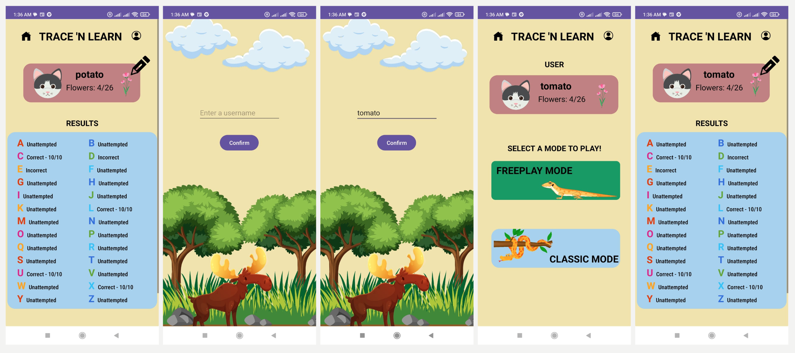
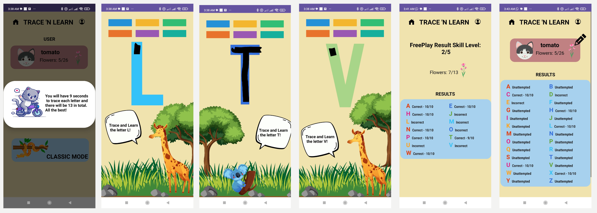

# Table Of Contents
1. [Introduction](#1-introduction)

2. [User Installation](#2-user-installation)

    2.1 [Step 1](#21-step-1)

    2.2 [Step 2](#22-step-2)

    2.3 [Step 3](#23-step-3)

3. [User Guide](#3-user-guide)

    3.1 [Home Page](#31-homepage)
    
    3.2 [Register](#32-register)

    3.3 [Username](#33-username)
    
    3.4 [Home Activity](#34-home-activity)

    3.5 [Profile Activity](#35-profile-activity)

    3.6 [Edit Username](#36-edit-username)

    3.7 [Changing Colours](#37-changing-colours)

    3.8 [Classic Mode](#38-classic-mode)

  
# 1. Introduction
This user manual will guide you through the setup and usage of the system. It is broken into 2 parts, user installation and user guide.
  
# 2. User Installation
## 2.1 Step 1
Please note that out code is not in the code repository, rather it is in a specific structure where there is the app folder with the main code and crucial peripherals outside it. The below instructions will work for the app, but there is no code folder. The code is in the app folder and the gradle file/folders combined as the app does not work when put inside code directory. So we had to put it outside the folder in the app and gradle file/folders.

Find the GitLab Repository URL. This can usually be found after clicking on the clone button of gitlabs project page. Copy the link that is below “clone with HTTPS” under clone button.

**Figure 1. - GitLab Repository URL**

It should look something like this: https://gitlab.computing.dcu.ie/laukaid2/2024-ca326-dlaukaityte-trace-n-learn.git
  
## 2.2 Step 2
Clone the repository in android studio. In order to import the project, Open android studio-> File->New->Project from version control.

**Figure 2. - Cloning repo part 1**

Select “Git” from the options presented after clicking on Project from Version Control and paste the link in.

**Figure 3. - Cloning repo part 2**

Click on clone.
  
## 2.3 Step 3
Import the project into Android Studio. After the cloning has been finished, open the project. Turn on developer settings in your phone which can differ from phone to phone depending on the make and model of them. Once developer settings have been turned on, ensure that the USB Debugging button and Install via USB button is turned on.

**Figure 4. - Debugging**

Connect your phone by USB to your laptop. Choose your phone from the list of available devices.

**Figure 5. - Device selection**

And finally, click on the green run button next to the device selection list. It will take a bit of time, but after compiling the app gets launched on your device.
  
# 3. User Guide
## 3.1 Home Page
When you click on the app icon from your apps list, you will be greeted with the introduction page. All you need to do is click on the “Play” button to start the game!

**Figure 6. - Homepage**
  
## 3.2 Register
Upon pressing the play button you will be prompted to this stage. The user is required to input a phone number with country code as in screen 1 below and press the “Send OTP” button to receive the otp. Doing so will take you to screen 2 which disappears in 2-3 seconds as it is just a check to ensure you are not a robot by firebase. After a few seconds the user will receive an OTP as seen in screen 3 and the user is expected to put it in the second box and click on “Verify OTP” button. Depending on if the code is correct or not - the user will be taken to the Username Page.

**Figure 7. - Register**
  
## 3.3 Username
The user will be prompted to enter a username. This username can or cannot be something that identifies the user, for example, pineapple, chair, or cloud and press on the “confirm” button which will take you to the Home activity. The username provided will be used to create a dashboard which the user will be able to access and see results for each letter as well as the the statistics we draw from it such as flowers, normalised scores to name a few so choose your names wisely!

**Figure 8. - Username**
  
## 3.4 Home Activity
Once the user name has been set, it takes the value and populates the home page where you have a mini window into the user’s stats (flower count which is how many letters they have done correctly). Between screen 1 and screen 2 the user has done 4 letters correctly in Classic mode. The flowers from freeplay mode are not shown permanently in the profile, it is shown only once at the end of the sprint which we will talk about later.

The user is presented with two modes they can play with “Freeplay” or “Classic”, between which they must choose.

There is a navigation bar to take the user back to the home page which is the same as the one the user is sent to, after setting the username as well as a profile icon (the circle) which will take the user to the profile page for a more detailed break down of results.

**Figure 9. - Home Activity**
  
## 3.5 Profile Activity
When the user clicks on circle in the top right corner of the profile it will take them to the profile page where they can see a detailed profile breakdown.

In the results section:
- Unattempted means they didn’t attempt the letter yet
- Correct means they traced the letter and it is correct.
- The score to the left of the correct text is a normlaised score out of 10 on how well they did.
- Incorrect means the letter traced was completed wrong.

In the profile section users can choose to edit the username using the pen icon.

**Figure 10. - Profile Activity**
  
## 3.6 Edit Username
On clicking on the pen icon it lets the user edit their username by taking them back to the username page.In screen 1 we have the profile page and by clicking on the pen icon we are able to move to the username page where we can add a new username. All the history of the user are retained with just the username changed. Once the user puts in the name username and clicks on “Confirm” where it takes the user back to the home page. In screen 4 below you can see that the username in home page and in screen 5 you can see that the username in profile page has also been updated.

**Figure 11. - Edit Username**
  
## 3.7 Changing Colours
The colour that is given by default to the users strokes are black. However they can pick out colours from the panel above them and change the colours of the strokes as they feel like. This feature remains in both freeplay and classic mode.

**Figure 12. - Changing colours**
  
## 3.8 Classic Mode
In Classic mode the user gets to choose letters from the 26 options which have been divided into different difficulty levels as seen in screens 2 and 3 below. 
The one differentiation between freeplay and classic mode is that the classic scores are permanently visible in the dashboard as opposed to freeplay which is visible just once. More on this later. 

For each letter that pops up audio is played - if its A then the audio will say “A”, “B” for B and so on. As you can see in screen 4, 5 and 6 if the letter is done correctly a dialog pops up saying “Good job!”, with a matching audio which reads it out loud. The values are then visible in the profile page, with flowers going up by 1 and the value changing for H from unattempted to correct!

**Figure 13. - Classic Mode**

But what if a user does a letter incorrectly? In that case we have 3 dialog boxes which displays with matching audio that plays with the dialog.

The three cases:
Screen 1 - if the user draws an H initially but goes out of bounds or if the user draws parts of H.
Screen 2 - If the user uses way too many strokes - for example “H” should be drawable in 4 strokes or lesser but if you above 4 you get that dialog box.
Screen 3 - If the user draws way too quick! The app is meant to help you learn how the letter flows, drawing too quick might hinder the learning.

**Figure 14. - Three Cases**
  
## 3.9 Freeplay mode
In Freeplay mode the users are greeted with a dialog with instructions and the appropriate matching audio as in screen 1 below. They get 9 seconds per letter for 13 letters to make their trace after which based on that letters accuracy level we decide which letter to give next. If you do L incorrectly you get T, that is slightly more complex than L, jumping by 2 if correct so you will get a capital I. Once the 13 letters are hit, based on how well you perform you get your results. The letters for each freeplay is different depending on how you perform in previous letters within the same mode.

Given below are two instances of free play where for each, the letters are different. The profile screen does not change in either as it only stores classic values. Freeplay results are a one time output.

**Figure 14. - Instance 1**

**Figure 14. - Instance 2**

Hope you had as much fun using our app as much as we did making it!

